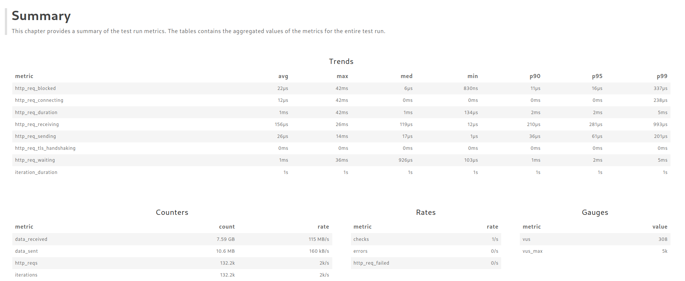

# Benchmark Testing: Ferrugem vs NGINX Load Balancer

This project aims to benchmark the performance of two load balancers, Ferrugem and NGINX, using a set of mock API services.

## Results

### Ferrugem

### Nginx

## Prerequisites
* Docker
* Docker Compose
* k6 (for load testing)
